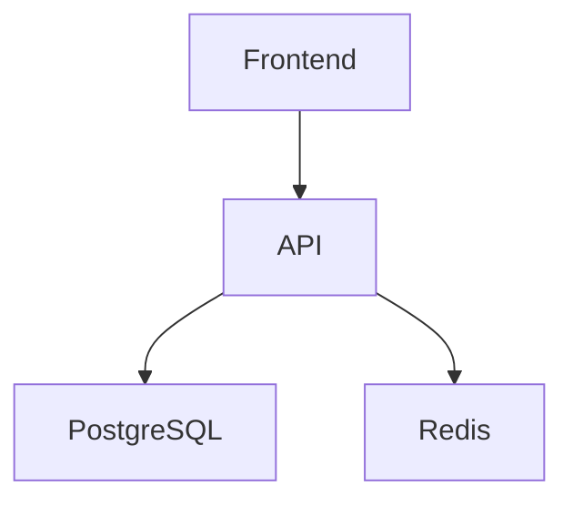

# AI Project Documentation Generator

Analyze the entire codebase and generate/update AI-friendly project documentation.

## Goal

Create a concise but complete knowledge base so that future AI coding agents can understand the project architecture, conventions, workflows, and business context with minimal additional explanation.

Documentation must be generated inside:
```
/docs
├── project.md
├── architecture.md
├── conventions.md
└── ai-context.md
```
If files already exist, update them instead of recreating from scratch.

---

# File Responsibilities

## /docs/project.md

Describe the project from a business and product perspective.

Include:

* Project purpose
* Main features
* Target users
* Business domain
* Core workflows
* Important modules
* External integrations
* Deployment environments

Keep it understandable for both humans and AI.

---

## /docs/architecture.md

Describe the technical architecture.

Include:

* High-level architecture
* Service boundaries
* Module responsibilities
* Request flow
* Data flow
* Database design overview
* External systems
* Event/message flows
* Background jobs
* Caching strategy
* Security considerations
* Scaling considerations

Use diagrams in Mermaid format whenever useful.

Example:



Focus on how the system actually works, not theoretical architecture.

---

## /docs/conventions.md

Extract coding conventions from the codebase.

Include:

* Folder structure rules
* Naming conventions
* API design patterns
* Error handling patterns
* Logging patterns
* Database conventions
* Testing conventions
* Dependency injection patterns
* Validation patterns
* Security practices
* Git workflow if detectable

Document only conventions that are actually used in the project.

---

## /docs/ai-context.md

Create a compact context file optimized for AI coding agents.

Include:

### Project Summary

Short summary of the project.

### Important Entry Points

Key files and directories.

### Core Business Logic

Critical business rules.

### Architecture Notes

Things AI should know before modifying code.

### Common Tasks

Examples:

* Add API endpoint
* Add database migration
* Add background job
* Add new module

### Do Not Break

List critical assumptions and sensitive areas.

### AI Working Rules

Examples:

* Follow conventions.md
* Reuse existing patterns
* Prefer existing abstractions
* Avoid introducing new frameworks
* Keep architecture consistency

Keep this file concise and highly information-dense.

---

# Discovery Instructions

Before generating documentation:

1. Analyze the entire repository.
2. Detect:

    * Languages
    * Frameworks
    * Libraries
    * Database systems
    * Infrastructure
    * Deployment methods
3. Infer architecture from actual code.
4. Infer conventions from actual implementation.
5. Avoid assumptions that are not supported by code.

---

# Output Quality Rules

* Be concise.
* Prefer bullet points.
* Avoid marketing language.
* Avoid generic explanations.
* Prefer facts extracted from code.
* Focus on information useful for future AI agents.

The generated documentation should allow a new AI coding agent to become productive in the project with minimal additional context.
